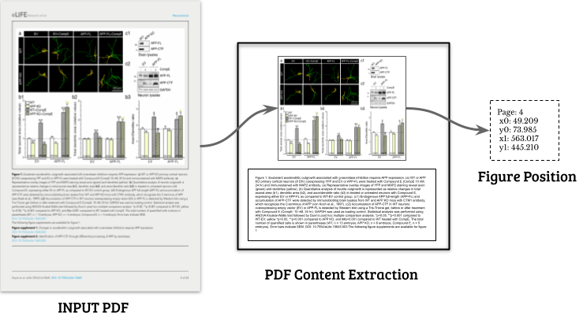
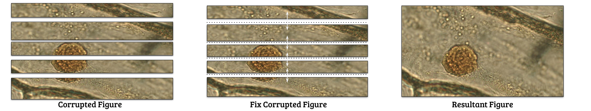

# PDF Content Extraction 
A  PDF Figure extraction tool for scientific documents.




The article page above was extracted from Kravets et al. [1] under creative commons (CC-BY).


The *PDF content extraction tool* extracts all figures along with their captions embedded in scientific PDF documents. The solution finds all figures embedded in the PDF document (source code) that were inserted during the document preparation.

As a special feature, the tool can extract figures from PDFs that suffered a certain level of corruption.

For instance, a figure that was cropped into several pieces due to an error in the PDF would be fixed:



The [figure](https://www.flickr.com/photos/146824358@N03/34062338520) above is licensed under Public Domain 


## Figure Extraction

### Instruction

A Dockerfile wrapping the solution and all needed environment is set in the `/docker`. 

To build the docker use:

​	`$ cd docker && ./build`

After this, use the script `run_image_extraction.sh` file to communicate with the docker and perform PDF figure extraction with the following command:

` $ run_image_extraction.sh <input_pdf_path> <output_directory> ` 


All extracted figures are saved in PNG and named as its position on the document followed by a figure ID. Example:

```
p-4-x0-40.000-y0-59.280-x1-553.600-y1-492.000-1.png
page = 4
x0   = 40.000
y0   = 59.280
x1   = 553.600
y1   = 492.000
ID   = 1
```


**Caption-only Extraction**

If you want to extract only the figures caption, follow the instructions located at [caption_extraction](https://github.com/danielmoreira/sciint/tree/pdf-content-extraction/caption_extraction).


# Evaluation

To evaluate the *PDF figure extraction*, we annotated the figures and caption of 285 PDFs scientific papers and downloaded the original figures and caption from its publishers' official website.

The file [pdf-content-extraction-experimental-setup.json](dataset_tasks/pdf-content-extraction/pdf-content-extraction-experimental-setup.json) contains all annotation that we used to evaluate the tool (i.e., Figures URLs, PDF URLs, Figure positions, Caption texts).


### Figure Extraction Evaluation

To evaluate the figure extraction, we compared the extracted figures with the figures downloaded from the paper's website.

**Metric**

1. [Structural similarity index](https://en.wikipedia.org/wiki/Structural_similarity) (SSIM).
We use the implementation of the scikit image library [4] during this evaluation.

2. Image Recall (IR). Number of images successfully extracted. For this, we considered all images that have `SSIM >= 0.7`


**Score**

1. Average SSIM  = 0.77 (0.29)
1. IR = 0.71


You can reproduce our results by running the [PDF Image Extraction](PDF%20Image%20Extraction.ipynb) Notebook.


### Text Evaluation 

To evaluate text extraction, we compared the extracted caption with the caption presented in the paper's website.

**Metrics**

1. [BERT-SCORE](https://arxiv.org/abs/1904.09675) F1-measure [2]

   This metric compares the semantic contextual of two sentences.

   We use the implementation of [2] with the sci-bert-en model ( BERT trained on  Scientific English documents) during the evaluation. 

2. [Levenshtein Similarity](https://en.wikipedia.org/wiki/Levenshtein_distance)

   This metric calculates the similarity of two strings based on the Levenshtein Distances, which consider each insertion, deletion, substitution alongside two strings.

   For this metric, we use the implementation of [3] during the evaluation.

**Score**

1. Average Bert-Score =  0.88 (0.24)
2. Average Levenshtein Similarity = 0.84 (0.31)

You can reproduce our results by running the [PDF Caption Extraction](PDF%20Caption%20Extraction.ipynb) Notebook.


## References

[1]  Kravets, Elisabeth et al. “Guanylate binding proteins directly attack Toxoplasma gondii via supramolecular complexes.” *eLife* vol. 5 e11479. 27 Jan. 2016, doi:10.7554/eLife.11479

[2] Zhang, Tianyi, et al. "Bertscore: Evaluating text generation with bert." (ICRL 2019).  Code: https://github.com/Tiiiger/bert_score

[3] **TextDistance** -- python library for comparing distance between two or more sequences by many algorithms. Code: https://github.com/life4/textdistance

[4]  Stéfan van der Walt, Johannes L. Schönberger, Juan Nunez-Iglesias, François Boulogne, Joshua D. Warner, Neil Yager, Emmanuelle Gouillart, Tony Yu and the scikit-image contributors. **scikit-image: Image processing in Python**. PeerJ 2:e453 (2014) https://doi.org/10.7717/peerj.453


## Cite this Work
Please cite as:
> Moreira, D., Cardenuto, J.P., Shao, R. et al. SILA: a system for scientific image analysis. Nature Scientific Reports 12 (18306), 2022.
> https://doi.org/10.1038/s41598-022-21535-3

```
@article{sila,
   author = {Moreira, Daniel and Cardenuto, João Phillipe and Shao, Ruiting and Baireddy, Sriram and Cozzolino, Davide and Gragnaniello, Diego and Abd‑Almageed, Wael and Bestagini, Paolo and Tubaro, Stefano and Rocha, Anderson and Scheirer, Walter and Verdoliva, Luisa and Delp, Edward},
   title = {{SILA: a system for scientifc image analysis}},
   journal = {Nature Scientific Reports},
   year = 2022,
   number = {12},
   volume = {18306},
   pages = {1--15}
}
```
