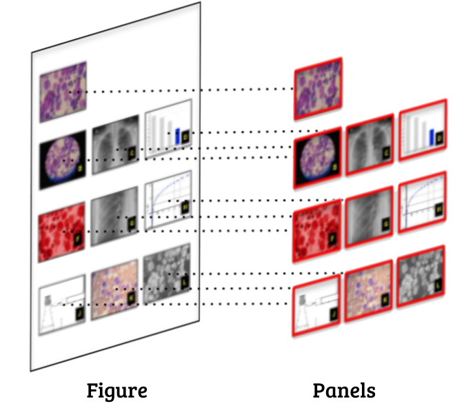

# Content Segmentation 

This module automatically segments a scientific figure into panels.

Typically, a scientific figure is presented with compound panels representing multiple aspects of an experiment (e.g., data plots, biological photos, diagrams). In this sense, this module assists in isolating the figure's panels for further analysis.





For this task, we used the implementation of Satoshi Tsutsui, and David Crandall [1]. Their code and model can be found at this [link](https://github.com/apple2373/figure-separator). 

- We are making available an adapted version of Compound Figure Separator [1] - [Google Drive](https://drive.google.com/file/d/1BVVN736dIm2Gb39g1A9yHNwAJT7PuKX6/view?usp=sharing) to our data


## Quick Run

**Installation**

Inside an isolated environment ([virtualenv](https://virtualenv.pypa.io/en/latest/), [conda](https://docs.conda.io/en/latest/)) using python3.6+, download the *Compound Figure Separator* model with the following code:

```
# Download and unzip the Compound Figure Separator model
FILENAME='panel_extraction_src.zip'
FILEID='1BVVN736dIm2Gb39g1A9yHNwAJT7PuKX6'
wget --load-cookies /tmp/cookies.txt -nc \
    "https://docs.google.com/uc?export=download&confirm=$(wget --quiet --save-cookies /tmp/cookies.txt --keep-session-cookies --no-check-certificate "https://docs.google.com/uc?export=download&id=$FILEID" -O- | sed -rn 's/.*confirm=([0-9A-Za-z_]+).*/\1\n/p')&id=$FILEID" \
    -O $FILENAME && rm -rf /tmp/cookies.txt
unzip -nq $FILENAME
```

After this step, install the requirements list located at `panel_extraction_src/requirements.txt`:

```
$ pip install -r panel_extraction_src/requirements.txt
```

**Test Installation**

You can test the installation by running a quick panel segmentation in a scientific figure. 

For testing purposes, we add to this repository a sample [figure](sample.png) collected from Zhou et al. [2] distributed under creative commons license (CC-BY).

To perform the test, run the following instructions inside a python shell:

```python
In [1]: from panel_extraction_src.PanelExtraction import PanelExtractionmodel 
In [2]: panel_extraction=PanelExtraction("panel_extraction_src/panel_extraction.pb")
In [3]: panel_extraction.extract('sample.png')
```

The expected output is the bounding-box position for each panel of the [figure](sample.png).

```
Out[3]: 
[{'x': 2, 'y': 129, 'w': 156, 'h': 119, 'conf': 0.9506},
 {'x': 162, 'y': 133, 'w': 158, 'h': 113, 'conf': 0.9428},
 {'x': 161, 'y': 2, 'w': 156, 'h': 124, 'conf': 0.9305},
 {'x': 3, 'y': 1, 'w': 167, 'h': 123, 'conf': 0.9258},
 {'x': 320, 'y': 0, 'w': 151, 'h': 131, 'conf': 0.9109},
 {'x': 318, 'y': 131, 'w': 153, 'h': 115, 'conf': 0.9099},
 {'x': 10, 'y': 241, 'w': 448, 'h': 114, 'conf': 0.8885},
 {'x': 59, 'y': 427, 'w': 356, 'h': 174, 'conf': 0.8802},
 {'x': 42, 'y': 353, 'w': 384, 'h': 83, 'conf': 0.8558}]
```


## Evaluation

### Data Annotation

The presented [annotation](dataset_tasks/segmentation/figure-panel-segmentation.json) is the agreement between two experts on pinpointing the position of each panel inside a scientific figure.

Thus, the evaluation dataset consists of 303 figures along with their panels' bounding-box position. 

We organize the annotation in a [JSON](dataset_tasks/segmentation/figure-panel-segmentation.json) file that indicates for each selected figure (identified by its DOI) the position of each annotated panels, as following:

```
<PAPER_DOI>: { # Article's Digital Object Identifier
        "figures": { # All anotated figures from the article
            <FIG_ID>: { # Figure number as it is expressed by the article (e.g., fig2)
                "panels": { # Panel Annotation
                    <PANEL_ID>: { 
                        "x0": <x0>, 
                        "y0": <y0>,
                        "x1": <x1>,
                        "y1": <y1>
                    }
                "figure-url": <Official_Figure_URL> # Official Figures URL published by the Journal
            }
        }
}
```


### Evaluation Metric

We use the **[Jaccard](https://en.wikipedia.org/wiki/Jaccard_index)** metric to evaluate the panel segmentation module.


### Results

Average Jaccard = 0.5 (0.2)

You can reproduce our experiment using the [Content Segmentation](Content%20Segmentation.ipynb) notebook.

# References

[1] Tsutsui, Satoshi, and David J. Crandall. "A data driven approach for compound figure separation using convolutional neural networks." *2017 14th IAPR International Conference on Document Analysis and Recognition (ICDAR)*. Vol. 1. IEEE, 2017.

[2] Zhou, Y., Zhang, J., Wu, H., Hogan, M. V., & Wang, J. H.-C. (2015). The differential effects of leukocyte-containing and pure platelet-rich plasma (PRP) on tendon stem/progenitor cells - implications of PRP application for the clinical treatment of tendon injuries. Stem Cell Research & Therapy, 6(1). https://doi.org/10.1186/s13287-015-0172-4
